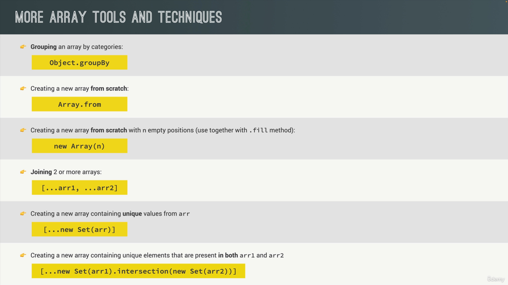

# Array Methods Reference

This comprehensive reference chart shows which JavaScript array method to use for different scenarios.

## Which Array Method to Use?

## Array Methods Practice Summary

!!! tip "Viewing the Images"
Click either image above to open it in a new tab for full-size viewing.

## Quick Reference Guide

Use this visual guide to quickly determine which array method best fits your needs:

- **To mutate original array**: Use methods like `push`, `pop`, `shift`, `unshift`, `splice`, `reverse`, `sort`, `fill`
- **A new array**: Use `map`, `filter`, `slice`, `concat`, `flat`, `flatMap`
- **An array index**: Use `indexOf`, `findIndex`, `findLastIndex`
- **An array element**: Use `find`, `findLast`
- **Know if array includes**: Use `includes`, `some`, `every`
- **A new string**: Use `join`
- **To transform to value**: Use `reduce`
- **To just loop array**: Use `forEach`

## Categories Explained

### Mutating Methods (Change Original Array)

Methods that modify the original array in place.

### Non-Mutating Methods (Return New Array)

Methods that return a new array without changing the original.

### Search & Test Methods

Methods that help you find elements or test conditions.

### Transformation Methods

Methods that convert arrays to other data types or structures.

---

_This reference chart helps you choose the right array method for any situation in your JavaScript projects._
