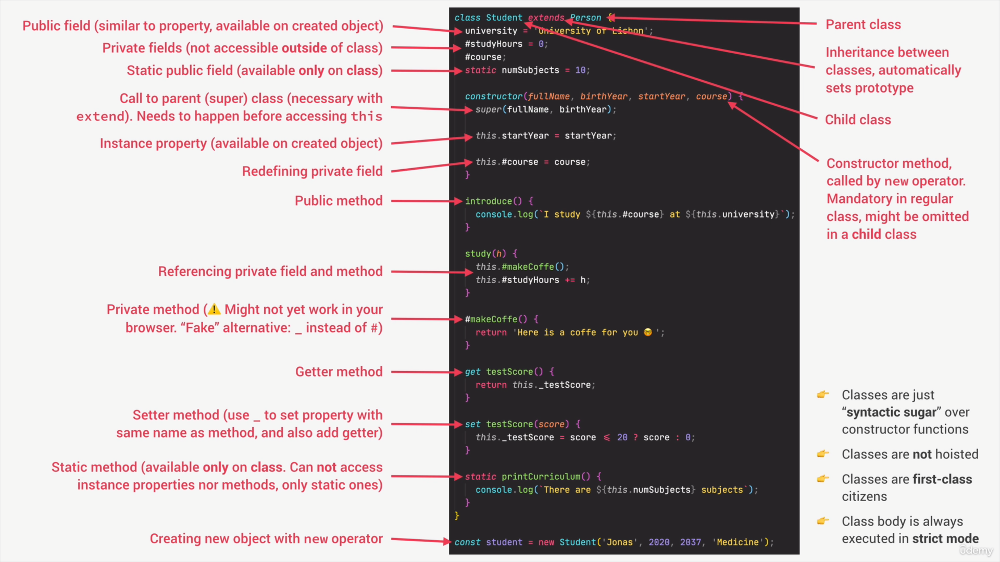

# Section 14: Object-Oriented Programming (OOP)

## Section Overview

This section covers Object-Oriented Programming in JavaScript, exploring different ways to implement OOP concepts:

1. **What is Object-Oriented Programming?** - OOP fundamentals and principles
2. **OOP in JavaScript: Prototypes** - How JavaScript implements OOP differently
3. **Constructor Functions and the new Operator** - Traditional way to create objects
4. **Prototypes and Prototypal Inheritance** - Understanding JavaScript's prototype chain
5. **Prototypal Inheritance on Built-In Objects** - Extending native objects
6. **ES6 Classes** - Modern syntax for object creation
7. **Setters and Getters** - Accessor properties for computed values
8. **Static Methods** - Methods attached to constructor/class, not instances
9. **Object.create** - Alternative way to create objects with specific prototypes
10. **Inheritance Between Classes** - Constructor functions, ES6 classes, Object.create
11. **Encapsulation: Private Class Fields and Methods** - Data privacy in classes
12. **Chaining Methods** - Creating fluent interfaces

## 🎯 Visual Summary: ES6 Classes Anatomy

[](../assets/images/es6classessummary.png)

**Key Elements in the Diagram:**

- **🔴 Parent Class** → Base class that other classes inherit from
- **🔵 Child Class** → Class that extends the parent class
- **🟡 Public Fields** → Properties available on created objects
- **🟠 Private Fields** → Properties only accessible within the class (# prefix)
- **🟢 Static Fields** → Properties available only on the class itself
- **🔶 Constructor** → Special method called when creating new instances
- **🟪 Methods** → Functions that belong to the class
- **⚡ Inheritance** → `extends` keyword automatically sets up prototype chain

**Jonas's Key Points from the Diagram:**

- **Classes are "syntactic sugar"** → Cleaner way to write constructor functions
- **Private fields (#)** → True encapsulation, not accessible outside class
- **Static methods** → Belong to class, not instances
- **super()** → Must be first line in child constructor
- **Getters/Setters** → Access properties like regular properties but with logic

## What is Object-Oriented Programming?

### OOP Fundamentals

Object-Oriented Programming is a programming paradigm based on the concept of objects. Objects contain data (properties) and code (methods) that work together.

### The 4 Fundamental OOP Principles

```javascript
// 1. ABSTRACTION
// Hide complex implementation details, show only essential features
class Car {
  start() {
    // PUBLIC METHOD - users can call this
    // Complex engine starting logic hidden from user
    this._igniteEngine(); // PRIVATE METHOD - internal use only
    this._activateSystems(); // PRIVATE METHOD - internal use only
    console.log('Car started!');
  }

  _igniteEngine() {
    // PRIVATE METHOD (convention: _ prefix)
    /* internal complexity hidden from user */
  }
  _activateSystems() {
    // PRIVATE METHOD (convention: _ prefix)
    /* internal complexity hidden from user */
  }
}
// 📝 NOTE: User only needs to know about start(), not the internal methods

// 2. ENCAPSULATION
// Keep properties and methods private inside the class
class BankAccount {
  #balance = 0; // PRIVATE FIELD - cannot access from outside

  deposit(amount) {
    // PUBLIC METHOD - controlled way to change balance
    this.#balance += amount; // Only THIS method can modify #balance
  }

  getBalance() {
    // PUBLIC METHOD - controlled way to read balance
    return this.#balance; // Only THIS method can read #balance
  }
}
// 📝 NOTE: #balance is protected - users can't accidentally mess with it

// 3. INHERITANCE
// Child classes inherit properties and methods from parent classes
class Animal {
  // PARENT CLASS (also called "superclass")
  move() {
    // PARENT METHOD - will be inherited
    console.log('Moving...');
  }
}

class Dog extends Animal {
  // CHILD CLASS (also called "subclass")
  bark() {
    // CHILD'S OWN METHOD
    console.log('Woof!');
  }
  // Dog automatically gets move() method from Animal
}
// 📝 NOTE: Dog can use both bark() and move() methods

// 4. POLYMORPHISM
// Child classes can override parent methods
class Bird extends Animal {
  // ANOTHER CHILD CLASS
  move() {
    // OVERRIDING parent's move() method
    console.log('Flying...'); // Different behavior than parent
  }
}
// 📝 NOTE: Bird.move() replaces Animal.move() - same method name, different behavior
```

### Benefits of OOP

- **Modularity**: Code organized in self-contained objects
- **Reusability**: Classes can be reused and extended
- **Maintainability**: Easier to modify and debug
- **Flexibility**: Polymorphism allows flexible code design

## OOP in JavaScript: Prototypes

### JavaScript's Unique Approach

Unlike classical OOP languages, JavaScript uses **prototypal inheritance**:

```javascript
// Classical OOP (Java, C++): Classes → Objects
// JavaScript: Objects → Objects (via prototypes)

// Every object has a prototype
const person = {
  // REGULAR OBJECT
  name: 'John', // PROPERTY
  age: 30, // PROPERTY
};

// person has a prototype: Object.prototype
console.log(person.__proto__ === Object.prototype); // true
// 📝 NOTE: __proto__ points to the object's prototype (where it inherits from)
```

**🎯 Quick Reference for Jonas's Videos:**

- When Jonas says "prototype chain" → he means the linked list of prototypes
- When he says "delegate" → he means "look up the chain for the method/property"
- When he says "own property" → he means property directly on the object (not inherited)

### Lesson 223: Prototypal Inheritance and the Prototype Chain

Prototypal inheritance means objects delegate property/method lookups to their prototype. The prototype chain is the linked list of prototypes followed during lookup until null.

Key points:

- Every object has an internal [[Prototype]] (accessible via `__proto__` or `Object.getPrototypeOf`).
- Methods and properties are found by walking up the chain when not on the instance.
- `Function.prototype`, `Array.prototype`, and `Object.prototype` sit in the chain; the top is `Object.prototype` → `null`.
- Use `isPrototypeOf` and constructor checks to reason about relationships.

```javascript
const arr = [1, 2, 3]; // ARRAY OBJECT

// Prototypes in the chain (when Jonas talks about "prototype chain")
console.log(Object.getPrototypeOf(arr) === Array.prototype); // true
// 📝 arr's immediate prototype is Array.prototype

console.log(Object.getPrototypeOf(Array.prototype) === Object.prototype); // true
// 📝 Array.prototype's prototype is Object.prototype

console.log(Object.getPrototypeOf(Object.prototype)); // null
// 📝 Object.prototype is the top - its prototype is null

// Method lookup through the chain (when Jonas says "JavaScript looks up the chain")
arr.push(4); // Found on Array.prototype (first stop in chain)
arr.toString(); // Found on Object.prototype (second stop in chain)

// Inspecting and checking relationships
console.log(Array.prototype.isPrototypeOf(arr)); // true - Array.prototype is in arr's chain
console.log(Object.prototype.isPrototypeOf(arr)); // true - Object.prototype is in arr's chain
console.log(arr.hasOwnProperty('push')); // false - push comes from prototype, not arr itself
```

**🎯 What Jonas means when he says:**

- **"Prototype chain"** → The linked list: arr → Array.prototype → Object.prototype → null
- **"JavaScript looks up the chain"** → If arr doesn't have a method, check Array.prototype, then Object.prototype
- **"Inherited method"** → Method found on prototype, not on the object itself
- **"Own property"** → Property directly on the object (hasOwnProperty returns true)

Practical notes:

- Prefer `Object.getPrototypeOf` over `__proto__` for readability and standards.
- Don’t modify `Object.prototype`; be cautious extending built-ins to avoid collisions.
- Instances share prototype methods (memory-efficient), while own properties live on the instance.

## Constructor Functions and the new Operator

### Creating Objects with Constructor Functions

```javascript
// CONSTRUCTOR FUNCTION (Jonas calls this "function constructor")
const Person = function (firstName, birthYear) {
  // Instance properties (Jonas: "these become properties on each object")
  this.firstName = firstName; // INSTANCE PROPERTY
  this.birthYear = birthYear; // INSTANCE PROPERTY

  // Never create methods inside constructor (Jonas: "this is bad practice!")
  // this.calcAge = function () {
  //   console.log(2037 - this.birthYear);
  // };
  // 📝 DON'T DO THIS: Each object would get its own copy (memory waste)
};

// CREATING INSTANCES (Jonas: "calling with new operator")
const jonas = new Person('Jonas', 1991); // INSTANCE OF Person
const matilda = new Person('Matilda', 2017); // INSTANCE OF Person

console.log(jonas instanceof Person); // true - jonas is an instance of Person
// 📝 NOTE: instanceof checks if Person.prototype is in jonas's prototype chain
```

**🎯 Jonas's Terminology:**

- **"Constructor function"** → Function used with `new` to create objects
- **"Instance"** → Object created from constructor function
- **"Instance properties"** → Properties unique to each object
- **"this keyword"** → Points to the newly created object when using `new`

### What Happens with the `new` Operator

```javascript
// When calling: new Person('Jonas', 1991)
// Jonas explains: "Here's what happens behind the scenes"

// 1. New empty object {} is created
// 2. Function is called, this = newly created object
// 3. Object is linked to prototype (Person.prototype)
// 4. Function automatically returns the object

const Person = function (firstName, birthYear) {
  // Step 2: this = {} (new empty object) - Jonas: "this points to new object"
  this.firstName = firstName; // Adding properties to the new object
  this.birthYear = birthYear; // Adding properties to the new object
  // Step 4: return this (happens automatically) - Jonas: "no need to write return"
};
```

**🎯 The 4 Steps Jonas Always Mentions:**

1. **Empty object created** → `{}`
2. **Function called** → `this` = new object
3. **Prototype linking** → Object linked to constructor's prototype
4. **Automatic return** → New object returned automatically

### Static Methods on Constructor Functions

```javascript
// CONSTRUCTOR FUNCTION
const Person = function (firstName, birthYear) {
  this.firstName = firstName;
  this.birthYear = birthYear;
};

// STATIC METHOD (Jonas: "attached to constructor, not instances")
Person.hey = function () {
  // STATIC METHOD
  console.log('Hey there 👋');
  console.log(this); // Points to Person constructor function itself
};

Person.hey(); // Works - called on the constructor
// jonas.hey(); // Error: not available on instances (Jonas: "instances can't access static methods")
```

**🎯 Static vs Instance Methods:**

- **Static method** → Attached to constructor function itself
- **Instance method** → Attached to prototype, available on all instances
- **Jonas says:** "Static methods are like utility functions related to the constructor"

## Prototypes and Prototypal Inheritance

### Adding Methods to Prototype

```javascript
// CONSTRUCTOR FUNCTION
const Person = function (firstName, birthYear) {
  this.firstName = firstName;
  this.birthYear = birthYear;
};

// Add methods to prototype (Jonas: "all instances will inherit this")
Person.prototype.calcAge = function () {
  // PROTOTYPE METHOD
  console.log(2037 - this.birthYear);
};

Person.prototype.species = 'Homo Sapiens'; // PROTOTYPE PROPERTY

// CREATING INSTANCE
const jonas = new Person('Jonas', 1991);
jonas.calcAge(); // 46 - method inherited from prototype

// Checking prototype relationships (Jonas talks about these checks a lot)
console.log(jonas.__proto__ === Person.prototype); // true
// 📝 jonas's prototype IS Person.prototype

console.log(Person.prototype.isPrototypeOf(jonas)); // true
// 📝 Person.prototype is in jonas's prototype chain

console.log(Person.prototype.isPrototypeOf(Person)); // false
// 📝 Person.prototype is NOT the prototype of Person constructor itself
```

**🎯 Key Terms Jonas Uses:**

- **"Prototype property"** → The `.prototype` property on constructor functions
- **"Instance's prototype"** → What `__proto__` points to (same as constructor's `.prototype`)
- **"Prototype chain"** → The linked inheritance chain
- **"Inherited"** → Method/property comes from prototype, not own property

### Property Lookup and hasOwnProperty

```javascript
const jonas = new Person('Jonas', 1991);

console.log(jonas.firstName); // Own property (Jonas: "this is jonas's own property")
console.log(jonas.species); // Inherited from prototype (Jonas: "this comes from prototype")

console.log(jonas.hasOwnProperty('firstName')); // true - it's on jonas object itself
console.log(jonas.hasOwnProperty('species')); // false - it's inherited from prototype
```

**🎯 When Jonas Says:**

- **"Own property"** → Property directly on the object (`hasOwnProperty` returns true)
- **"Inherited property"** → Property from prototype chain (`hasOwnProperty` returns false)
- **"Property lookup"** → JavaScript first checks object, then prototype chain

### Practical Prototype Example

```javascript
// CONSTRUCTOR FUNCTION
const Calculator = function () {};

// PROTOTYPE METHODS (Jonas: "shared by all calculator instances")
Calculator.prototype.add = function (a, b) {
  return a + b;
};

Calculator.prototype.multiply = function (a, b) {
  return a * b;
};

Calculator.prototype.memory = 0; // PROTOTYPE PROPERTY

Calculator.prototype.memorize = function (value) {
  this.memory = value; // Setting instance property
  return this; // METHOD CHAINING (return this)
};

// CREATING INSTANCES
const calc1 = new Calculator(); // FIRST INSTANCE
const calc2 = new Calculator(); // SECOND INSTANCE

console.log(calc1.add(5, 3)); // 8 - using inherited method
console.log(calc2.multiply(4, 2)); // 8 - using inherited method

// Shared prototype methods, separate instances
calc1.memorize(10); // Sets memory on calc1 instance
console.log(calc1.memory); // 10   // calc1's own memory property
console.log(calc2.memory); // 0    // calc2 still has prototype's memory value
```

**🎯 Jonas's Key Points:**

- **"Shared methods"** → All instances use same method from prototype (memory efficient)
- **"Separate instances"** → Each object has its own property values
- **"Method chaining"** → Returning `this` allows chaining like `calc.add().multiply()`

## Prototypal Inheritance on Built-In Objects

### Exploring Built-in Prototypes

```javascript
const arr = [3, 6, 6, 5, 6, 9, 9]; // ARRAY INSTANCE

// Array prototype chain (Jonas: "let's explore the prototype chain")
console.log(arr.__proto__ === Array.prototype); // true
// 📝 arr's immediate prototype is Array.prototype

console.log(arr.__proto__.__proto__ === Object.prototype); // true
// 📝 Array.prototype's prototype is Object.prototype

console.log(arr.__proto__.__proto__.__proto__); // null
// 📝 Object.prototype is the top of the chain

// Function prototype (Jonas: "functions are objects too!")
console.dir((x) => x + 1); // Shows function's prototype chain in dev tools
```

**🎯 Prototype Chain Visualization:**

```text
arr → Array.prototype → Object.prototype → null
```

**Jonas says:** "Everything in JavaScript (except null/undefined) has a prototype chain leading to Object.prototype"

### Extending Built-in Objects (Use with Caution)

```javascript
// Adding method to Array prototype (Jonas: "extending built-in objects")
Array.prototype.unique = function () {
  // EXTENDING Array.prototype
  return [...new Set(this)]; // 'this' refers to the array
};

const numbers = [1, 2, 2, 3, 3, 4];
console.log(numbers.unique()); // [1, 2, 3, 4] - using our custom method

// Why this is generally not recommended (Jonas's warnings):
// 1. Can break existing code
// 2. May conflict with future JS updates
// 3. Team confusion
// 4. Better to use utility functions instead
```

**🎯 Jonas's Warning:** "Don't extend built-in prototypes in real projects!"

**Why it's bad:**

- **Name collisions** → Your method might conflict with future JS features
- **Team confusion** → Other developers won't expect custom methods on built-ins
- **Breaking changes** → Libraries might expect standard behavior

### Safer Alternative: Utility Functions

```javascript
// Instead of extending built-ins, create utility functions (Jonas: "much safer approach")
const ArrayUtils = {
  // UTILITY OBJECT
  unique(arr) {
    // UTILITY METHOD
    return [...new Set(arr)];
  },

  flatten(arr) {
    // UTILITY METHOD
    return arr.flat(Infinity);
  },

  groupBy(arr, key) {
    // UTILITY METHOD
    return arr.reduce((groups, item) => {
      const group = item[key];
      groups[group] = groups[group] || [];
      groups[group].push(item);
      return groups;
    }, {});
  },
};

// Usage (Jonas: "explicit and clear what's happening")
const numbers = [1, 2, 2, 3, 3, 4];
console.log(ArrayUtils.unique(numbers)); // [1, 2, 3, 4]
```

**🎯 Jonas prefers this because:**

- **No prototype pollution** → Doesn't modify built-in objects
- **Explicit** → Clear where the method comes from
- **Safe** → Won't conflict with future JavaScript updates

## ES6 Classes

### Class Declaration Syntax

```javascript
// Class declaration (Jonas: "modern way to create constructor function")
class PersonCl {
  constructor(fullName, birthYear) {
    // CONSTRUCTOR METHOD (like function constructor)
    this.fullName = fullName; // INSTANCE PROPERTIES
    this.birthYear = birthYear; // INSTANCE PROPERTIES
  }

  // Instance methods (Jonas: "automatically added to prototype")
  calcAge() {
    // INSTANCE METHOD (on prototype)
    console.log(2037 - this.birthYear);
  }

  greet() {
    // INSTANCE METHOD (on prototype)
    console.log(`Hey ${this.fullName}`);
  }
}

const jessica = new PersonCl('Jessica Davis', 1996);
jessica.calcAge(); // 41

// Classes are just syntactic sugar over constructor functions (Jonas: "same result, cleaner syntax")
console.log(jessica.__proto__ === PersonCl.prototype); // true
```

**🎯 Jonas's Key Points:**

- **"Syntactic sugar"** → Classes are just a prettier way to write constructor functions
- **Constructor method** → Replaces the constructor function
- **Methods automatically go to prototype** → No need to manually add to `.prototype`
- **Same prototype chain** → Works exactly like constructor functions under the hood

### Class Expression

```javascript
// Class expression (Jonas: "classes are first-class citizens")
const PersonCl = class {
  // CLASS EXPRESSION (alternative syntax)
  constructor(name, birthYear) {
    // CONSTRUCTOR
    this.name = name;
    this.birthYear = birthYear;
  }

  calcAge() {
    // METHOD (goes to prototype)
    return 2037 - this.birthYear;
  }
};
```

**🎯 Class Declaration vs Expression:**

- **Class declaration** → `class PersonCl { }`
- **Class expression** → `const PersonCl = class { }`
- **Jonas says:** "Use whichever fits your coding style"

### Important Notes About Classes

```javascript
// 1. Classes are NOT hoisted (Jonas: "cannot use before declaration")
// console.log(MyClass); // ReferenceError - unlike function declarations
// class MyClass {}

// 2. Classes are first-class citizens (Jonas: "can be passed as arguments")
function createInstance(ClassConstructor, ...args) {
  // FUNCTION PARAMETER
  return new ClassConstructor(...args); // CREATING INSTANCE
}

const person = createInstance(PersonCl, 'John', 1990); // PASSING CLASS AS ARGUMENT

// 3. Classes are always executed in strict mode (Jonas: "automatically strict")
class StrictClass {
  constructor() {
    // This will be undefined in strict mode
    console.log(this); // PersonCl instance (not global object)
  }
}
```

**🎯 Important Differences from Function Constructors:**

- **Not hoisted** → Must declare before use (unlike function declarations)
- **Always strict mode** → No accidental global variables
- **First-class citizens** → Can be passed around like any other value

## Setters and Getters

### Getters and Setters in Objects

```javascript
const account = {
  owner: 'Jonas',
  movements: [200, 530, 120, 300],

  // Getter - accessed like a property (Jonas: "no parentheses needed")
  get latest() {
    // GETTER METHOD
    return this.movements.slice(-1).pop(); // Returns last movement
  },

  // Setter - called when property is assigned (Jonas: "triggered by assignment")
  set latest(mov) {
    // SETTER METHOD
    this.movements.push(mov); // Adds movement to array
  },
};

console.log(account.latest); // 300 (calls getter) - Jonas: "looks like property access"
account.latest = 50; // Calls setter - Jonas: "looks like assignment"
console.log(account.movements); // [200, 530, 120, 300, 50]
```

**🎯 Getters vs Setters:**

- **Getter** → Accessed like property (no parentheses), returns a value
- **Setter** → Triggered by assignment (=), takes one parameter
- **Jonas says:** "Makes your object interface more natural"

### Getters/Setters in Classes and Additional Notes

```javascript
class PersonCl {
  constructor(fullName, birthYear) {
    this.fullName = fullName; // triggers setter (Jonas: "assignment calls setter")
    this.birthYear = birthYear;
  }

  get age() {
    // GETTER - computed property
    return 2037 - this.birthYear;
  }

  set fullName(name) {
    // SETTER - validates input
    if (name.includes(' '))
      this._fullName = name; // Store in _fullName (convention)
    else console.log(`${name} is not a full name!`);
  }

  get fullName() {
    // GETTER - returns stored value
    return this._fullName;
  }

  static hey() {
    // STATIC METHOD
    console.log('Hey there 👋');
  }
}
```

**🎯 Jonas's Naming Convention:**

- **`_fullName`** → Private property (convention, not truly private)
- **Getter/Setter pair** → Same name but different functionality
- **Validation in setter** → Ensures data integrity
- **Computed property in getter** → Calculates value on access

## Static Methods

### Static Methods in Constructor Functions

```javascript
// CONSTRUCTOR FUNCTION APPROACH
const Person = function (firstName, birthYear) {
  this.firstName = firstName;
  this.birthYear = birthYear;
};

// Static method (Jonas: "attached to constructor function itself")
Person.hey = function () {
  // STATIC METHOD
  console.log('Hey there 👋');
  console.log(this); // Points to Person constructor function
};

Person.hey(); // Works - called on constructor
// jonas.hey(); // Error - not available on instances (Jonas: "instances can't access this")
```

**🎯 Jonas explains:** "Static methods belong to the class/constructor, not to instances"

### Static Methods in Classes

```javascript
class PersonCl {
  constructor(fullName, birthYear) {
    this.fullName = fullName;
    this.birthYear = birthYear;
  }

  // Instance method (Jonas: "available on all instances")
  calcAge() {
    // INSTANCE METHOD
    console.log(2037 - this.birthYear);
  }

  // Static method (Jonas: "belongs to class, not instances")
  static hey() {
    // STATIC METHOD
    console.log('Hey there 👋');
    console.log(this); // Points to PersonCl class
  }

  static createAnonymous() {
    // STATIC FACTORY METHOD
    return new this('Anonymous', 2000); // 'this' refers to PersonCl class
  }
}

PersonCl.hey(); // Works - called on class
const anon = PersonCl.createAnonymous(); // Factory method pattern
console.log(anon.fullName); // 'Anonymous'
```

**🎯 Static Method Uses:**

- **Utility functions** → Related to the class but don't need instance data
- **Factory methods** → Alternative ways to create instances
- **Helper functions** → Class-related functionality that's not instance-specific

### Practical Static Method Examples

```javascript
class MathUtils {
  static PI = 3.14159;

  static circleArea(radius) {
    return this.PI * radius * radius;
  }

  static rectangleArea(width, height) {
    return width * height;
  }

  static randomBetween(min, max) {
    return Math.floor(Math.random() * (max - min + 1)) + min;
  }
}

console.log(MathUtils.circleArea(5)); // 78.54
console.log(MathUtils.randomBetween(1, 10)); // Random number 1-10

class User {
  constructor(name, email) {
    this.name = name;
    this.email = email;
    this.id = User.generateId();
  }

  static users = [];

  static generateId() {
    return Date.now().toString(36) + Math.random().toString(36).substr(2);
  }

  static findByEmail(email) {
    return this.users.find((user) => user.email === email);
  }

  static createAndRegister(name, email) {
    const user = new this(name, email);
    this.users.push(user);
    return user;
  }
}

const user1 = User.createAndRegister('John', 'john@example.com');
const found = User.findByEmail('john@example.com');
```

## Object.create

### Creating Objects with Object.create

```javascript
// Define prototype object (Jonas: "blueprint object")
const PersonProto = {
  // PROTOTYPE OBJECT (not a constructor)
  calcAge() {
    // METHOD that will be inherited
    console.log(2037 - this.birthYear);
  },

  init(firstName, birthYear) {
    // INITIALIZATION METHOD (manual constructor)
    this.firstName = firstName; // Setting properties on instance
    this.birthYear = birthYear; // Setting properties on instance
  },
};

// Create object with specific prototype (Jonas: "manually setting prototype")
const steven = Object.create(PersonProto); // CREATING OBJECT with PersonProto as prototype
steven.name = 'Steven'; // ADDING PROPERTIES manually
steven.birthYear = 2002; // ADDING PROPERTIES manually
steven.calcAge(); // 35 - inherited method from PersonProto

console.log(steven.__proto__ === PersonProto); // true - PersonProto is steven's prototype

// Using init method for cleaner creation (Jonas: "better way to initialize")
const sarah = Object.create(PersonProto); // CREATE OBJECT
sarah.init('Sarah', 1979); // INITIALIZE using init method
sarah.calcAge(); // 58
```

**🎯 Object.create vs new Constructor():**

- **Object.create()** → Directly sets prototype, no constructor function needed
- **new Constructor()** → Uses constructor function and automatic prototype linking
- **Jonas says:** "Object.create gives you more control over the prototype chain"

### Object.create vs Constructor Functions vs Classes

```javascript
// 1. Constructor Function approach (Jonas: "traditional way")
const PersonConstructor = function (name, birthYear) {
  // CONSTRUCTOR FUNCTION
  this.name = name;
  this.birthYear = birthYear;
};
PersonConstructor.prototype.calcAge = function () {
  // PROTOTYPE METHOD
  return 2037 - this.birthYear;
};

// 2. ES6 Class approach (Jonas: "modern syntax")
class PersonClass {
  // ES6 CLASS
  constructor(name, birthYear) {
    // CONSTRUCTOR METHOD
    this.name = name;
    this.birthYear = birthYear;
  }

  calcAge() {
    // INSTANCE METHOD (auto on prototype)
    return 2037 - this.birthYear;
  }
}

// 3. Object.create approach (Jonas: "manual prototype setup")
const PersonProto = {
  // PROTOTYPE OBJECT
  init(name, birthYear) {
    // INIT METHOD
    this.name = name;
    this.birthYear = birthYear;
  },

  calcAge() {
    // INHERITED METHOD
    return 2037 - this.birthYear;
  },
};

// All create objects with prototype-based inheritance (Jonas: "same result, different syntax")
const person1 = new PersonConstructor('John', 1990); // CONSTRUCTOR FUNCTION WAY
const person2 = new PersonClass('Jane', 1992); // CLASS WAY
const person3 = Object.create(PersonProto); // OBJECT.CREATE WAY
person3.init('Bob', 1988);
```

**🎯 All Three Approaches:**

- **Result** → Objects with prototype-based inheritance
- **Performance** → All equally fast
- **Choice** → Personal/team preference and project requirements

## Inheritance Between Classes

### Inheritance with Constructor Functions

```javascript
// Parent constructor (Jonas: "this will be the superclass")
const Person = function (firstName, birthYear) {
  // PARENT CONSTRUCTOR
  this.firstName = firstName;
  this.birthYear = birthYear;
};

Person.prototype.calcAge = function () {
  // PARENT METHOD (on prototype)
  console.log(2037 - this.birthYear);
};

// Child constructor (Jonas: "this will inherit from Person")
const Student = function (firstName, birthYear, course) {
  // CHILD CONSTRUCTOR
  // Call parent constructor (Jonas: "we need to call Person constructor")
  Person.call(this, firstName, birthYear); // BORROWING parent constructor
  this.course = course; // CHILD-SPECIFIC PROPERTY
};

// Link prototypes (Jonas: "this is the tricky part - connecting prototypes")
Student.prototype = Object.create(Person.prototype); // INHERITANCE SETUP
// 📝 Student.prototype now inherits from Person.prototype

// Add child-specific methods
Student.prototype.introduce = function () {
  // CHILD-SPECIFIC METHOD
  console.log(`My name is ${this.firstName} and I study ${this.course}`);
};

// Fix constructor reference (Jonas: "important to fix this")
Student.prototype.constructor = Student; // FIXING CONSTRUCTOR REFERENCE

const mike = new Student('Mike', 2020, 'Computer Science');
mike.introduce(); // My name is Mike and I study Computer Science (child method)
mike.calcAge(); // 17 (inherited from Person)

// Checking inheritance (Jonas: "mike is instance of both classes")
console.log(mike instanceof Student); // true
console.log(mike instanceof Person); // true  - inheritance working!
console.log(mike instanceof Object); // true
```

**🎯 The Inheritance Steps Jonas Always Mentions:**

1. **Person.call(this, ...)** → Borrow parent constructor to set properties
2. **Object.create(Person.prototype)** → Link child prototype to parent prototype
3. **Add child methods** → After linking, add child-specific methods
4. **Fix constructor** → Point constructor back to child

**🎯 Prototype Chain Result:**

```text
mike → Student.prototype → Person.prototype → Object.prototype → null
```

### Inheritance with ES6 Classes

```javascript
// Parent class (Jonas: "this is our superclass")
class PersonCl {
  // PARENT CLASS
  constructor(fullName, birthYear) {
    // PARENT CONSTRUCTOR
    this.fullName = fullName;
    this.birthYear = birthYear;
  }

  calcAge() {
    // PARENT METHOD
    console.log(2037 - this.birthYear);
  }

  greet() {
    // PARENT METHOD
    console.log(`Hey ${this.fullName}`);
  }
}

// Child class (Jonas: "this extends the parent class")
class StudentCl extends PersonCl {
  // CHILD CLASS with EXTENDS keyword
  constructor(fullName, birthYear, course) {
    // Call parent constructor (Jonas: "super must be first!")
    super(fullName, birthYear); // SUPER() calls parent constructor
    this.course = course; // CHILD-SPECIFIC PROPERTY
  }

  introduce() {
    // CHILD-SPECIFIC METHOD
    console.log(`My name is ${this.fullName} and I study ${this.course}`);
  }

  // Override parent method (Jonas: "polymorphism in action")
  calcAge() {
    // OVERRIDING parent method
    console.log(
      `I'm ${
        2037 - this.birthYear
      } years old, but as a student I feel more like ${
        2037 - this.birthYear + 10
      }`
    );
  }
}

const martha = new StudentCl('Martha Jones', 2012, 'Computer Science');
martha.introduce(); // My name is Martha Jones and I study Computer Science
martha.calcAge(); // I'm 25 years old, but as a student I feel more like 35 (overridden method)
```

**🎯 ES6 Class Inheritance Keywords:**

- **extends** → Creates inheritance between classes
- **super()** → Calls parent constructor (must be first line in child constructor)
- **Method override** → Child method replaces parent method (polymorphism)
- **Jonas says:** "Much cleaner than constructor function inheritance!"

### Inheritance with Object.create

```javascript
// Parent prototype object (Jonas: "this will be inherited from")
const PersonProto = {
  // PARENT PROTOTYPE
  calcAge() {
    // PARENT METHOD
    console.log(2037 - this.birthYear);
  },

  init(firstName, birthYear) {
    // PARENT INIT METHOD
    this.firstName = firstName;
    this.birthYear = birthYear;
  },
};

// Create student prototype that inherits from PersonProto (Jonas: "linking prototypes manually")
const StudentProto = Object.create(PersonProto); // CHILD PROTOTYPE inherits from PARENT

StudentProto.init = function (firstName, birthYear, course) {
  // CHILD INIT METHOD
  PersonProto.init.call(this, firstName, birthYear); // CALL PARENT INIT
  this.course = course; // CHILD-SPECIFIC PROPERTY
};

StudentProto.introduce = function () {
  // CHILD-SPECIFIC METHOD
  console.log(`My name is ${this.firstName} and I study ${this.course}`);
};

// Create instance (Jonas: "using Object.create with child prototype")
const jay = Object.create(StudentProto); // CREATE INSTANCE from CHILD PROTOTYPE
jay.init('Jay', 2010, 'Computer Science'); // INITIALIZE using child init
jay.introduce(); // My name is Jay and I study Computer Science (child method)
jay.calcAge(); // 27 (inherited from PersonProto)
```

**🎯 Object.create Inheritance Chain:**

```text
jay → StudentProto → PersonProto → Object.prototype → null
```

**Jonas says:** "This is the most manual approach, but gives you full control over the prototype chain"

## Encapsulation: Private Class Fields and Methods

### Public and Private Fields

```javascript
class Account {
  // 1) Public fields (Jonas: "these are on instances, not prototype")
  locale = navigator.language; // PUBLIC FIELD (on every instance)

  // 2) Private fields (Jonas: "truly private, cannot access from outside")
  #movements = []; // PRIVATE FIELD (# makes it private)
  #pin; // PRIVATE FIELD (declared but not set)

  constructor(owner, currency, pin) {
    this.owner = owner; // PUBLIC PROPERTY
    this.currency = currency; // PUBLIC PROPERTY
    this.#pin = pin; // SETTING PRIVATE FIELD

    console.log(`Thanks for opening an account, ${owner}`);
  }

  // 3) Public methods (Jonas: "the public API of our class")
  getMovements() {
    // PUBLIC METHOD
    return this.#movements; // Accessing private field from inside
  }

  deposit(val) {
    // PUBLIC METHOD
    this.#movements.push(val); // Modifying private field
    return this; // For chaining (Jonas: "return this for chaining")
  }

  withdraw(val) {
    // PUBLIC METHOD
    this.deposit(-val); // Reusing deposit method
    return this; // For chaining
  }

  // 4) Private methods (Jonas: "these are implementation details")
  #approveLoan(val) {
    // PRIVATE METHOD (# prefix)
    return true; // Simplified approval logic
  }

  requestLoan(val) {
    // PUBLIC METHOD
    if (this.#approveLoan(val)) {
      // Calling private method from inside
      this.deposit(val);
      console.log(`Loan approved`);
    }
    return this;
  }
}

const acc1 = new Account('Jonas', 'EUR', 1111);

acc1.deposit(250);
acc1.withdraw(140);
console.log(acc1.getMovements()); // [250, -140]

// These won't work (Jonas: "completely private, will throw errors"):
// console.log(acc1.#movements); // SyntaxError - cannot access private field
// console.log(acc1.#pin);       // SyntaxError - cannot access private field
// acc1.#approveLoan(1000);      // SyntaxError - cannot access private method
```

**🎯 Public vs Private (Jonas's Explanation):**

- **Public fields/methods** → Accessible from outside the class
- **Private fields/methods** → Only accessible from inside the class (# prefix)
- **True privacy** → Unlike `_property` convention, # actually prevents access
- **Encapsulation** → Data is protected from accidental modification

### Static Fields and Methods

```javascript
class Account {
  // Static public field
  static numAccounts = 0;

  // Static private field
  static #bankName = 'Bankist Bank';

  constructor(owner, currency, pin) {
    this.owner = owner;
    this.currency = currency;
    this.pin = pin;

    // Increment account counter
    Account.numAccounts++;
  }

  // Static public method
  static getBankName() {
    return this.#bankName;
  }

  // Static private method
  static #validateAccountData(data) {
    return data.owner && data.currency && data.pin;
  }

  static createAccount(owner, currency, pin) {
    const accountData = { owner, currency, pin };

    if (this.#validateAccountData(accountData)) {
      return new this(owner, currency, pin);
    } else {
      throw new Error('Invalid account data');
    }
  }
}

console.log(Account.numAccounts); // 0
const acc1 = Account.createAccount('John', 'USD', 1234);
console.log(Account.numAccounts); // 1
console.log(Account.getBankName()); // 'Bankist Bank'
```

## Chaining Methods

### Implementing Method Chaining

```javascript
class Account {
  #movements = [];

  deposit(val) {
    // METHOD 1
    this.#movements.push(val);
    return this; // RETURN 'this' to enable chaining
  }

  withdraw(val) {
    // METHOD 2
    this.deposit(-val); // Reuse deposit method
    return this; // RETURN 'this' to enable chaining
  }

  requestLoan(val) {
    // METHOD 3
    if (this.#approveLoan(val)) {
      this.deposit(val);
      console.log(`Loan approved`);
    }
    return this; // RETURN 'this' to enable chaining
  }

  #approveLoan(val) {
    // PRIVATE METHOD
    return true;
  }

  getMovements() {
    // METHOD 4 (terminal method)
    return this.#movements; // RETURNS DATA, not 'this'
    // Note: getMovements doesn't return 'this' because it returns data
    // This breaks the chain, so it should be called last
  }
}

const acc1 = new Account('Jonas', 'EUR', 1111);

// Method chaining in action (Jonas: "fluent interface")
const movements = acc1
  .deposit(300) // Returns acc1 (this) → acc1.deposit(500)
  .deposit(500) // Returns acc1 (this) → acc1.withdraw(35)
  .withdraw(35) // Returns acc1 (this) → acc1.requestLoan(25000)
  .requestLoan(25000) // Returns acc1 (this) → acc1.withdraw(4000)
  .withdraw(4000) // Returns acc1 (this) → acc1.getMovements()
  .getMovements(); // Returns array (breaks chain) - MUST BE LAST

console.log(movements); // [300, 500, -35, 25000, -4000]
```

**🎯 Method Chaining Rules:**

- **Return `this`** → Allows calling another method on the same object
- **Fluent interface** → Reads like natural language
- **Terminal methods** → Methods that return data (break the chain)
- **Jonas says:** "Makes your code more readable and expressive"

### Advanced Chaining Example

```javascript
class QueryBuilder {
  constructor(data) {
    this.data = data;
    this.result = [...data]; // Copy to avoid mutation
  }

  where(predicate) {
    this.result = this.result.filter(predicate);
    return this;
  }

  orderBy(key, direction = 'asc') {
    this.result.sort((a, b) => {
      if (direction === 'asc') {
        return a[key] > b[key] ? 1 : -1;
      } else {
        return a[key] < b[key] ? 1 : -1;
      }
    });
    return this;
  }

  select(keys) {
    this.result = this.result.map((item) => {
      const selected = {};
      keys.forEach((key) => (selected[key] = item[key]));
      return selected;
    });
    return this;
  }

  limit(count) {
    this.result = this.result.slice(0, count);
    return this;
  }

  execute() {
    return this.result; // Terminal method
  }
}

const users = [
  { name: 'John', age: 30, salary: 50000 },
  { name: 'Jane', age: 25, salary: 60000 },
  { name: 'Bob', age: 35, salary: 45000 },
  { name: 'Alice', age: 28, salary: 70000 },
];

const result = new QueryBuilder(users)
  .where((user) => user.age > 25)
  .orderBy('salary', 'desc')
  .select(['name', 'salary'])
  .limit(2)
  .execute();

console.log(result);
// [{ name: 'Alice', salary: 70000 }, { name: 'Jane', salary: 60000 }]
```

## Coding Challenges

### Challenge 1: Car Constructor Function

```javascript
const Car = function (make, speed) {
  this.make = make;
  this.speed = speed;
};

Car.prototype.accelerate = function () {
  this.speed += 10;
  console.log(`${this.make} is going at ${this.speed} km/h`);
};

Car.prototype.brake = function () {
  this.speed -= 5;
  console.log(`${this.make} is going at ${this.speed} km/h`);
};

const bmw = new Car('BMW', 120);
const mercedes = new Car('Mercedes', 95);

bmw.accelerate(); // BMW is going at 130 km/h
bmw.accelerate(); // BMW is going at 140 km/h
bmw.brake(); // BMW is going at 135 km/h
```

### Challenge 2: Car with ES6 Classes

```javascript
class CarCl {
  constructor(make, speed) {
    this.make = make;
    this.speed = speed;
  }

  accelerate() {
    this.speed += 10;
    console.log(`${this.make} is going at ${this.speed} km/h`);
  }

  brake() {
    this.speed -= 5;
    console.log(`${this.make} is going at ${this.speed} km/h`);
  }

  get speedUS() {
    return this.speed / 1.6;
  }

  set speedUS(speed) {
    this.speed = speed * 1.6;
  }
}

const ford = new CarCl('Ford', 120);
console.log(ford.speedUS); // 75
ford.accelerate(); // Ford is going at 130 km/h
ford.speedUS = 50;
console.log(ford.speed); // 80
```

### Challenge 3: Electric Car Inheritance

```javascript
const Car = function (make, speed) {
  this.make = make;
  this.speed = speed;
};

Car.prototype.accelerate = function () {
  this.speed += 10;
  console.log(`${this.make} is going at ${this.speed} km/h`);
};

Car.prototype.brake = function () {
  this.speed -= 5;
  console.log(`${this.make} is going at ${this.speed} km/h`);
};

const EV = function (make, speed, charge) {
  Car.call(this, make, speed);
  this.charge = charge;
};

// Link prototypes
EV.prototype = Object.create(Car.prototype);

EV.prototype.chargeBattery = function (chargeTo) {
  this.charge = chargeTo;
};

// Override accelerate method (polymorphism)
EV.prototype.accelerate = function () {
  this.speed += 20;
  this.charge--;
  console.log(
    `${this.make} is going at ${this.speed} km/h, with a charge of ${this.charge}%`
  );
};

const tesla = new EV('Tesla', 120, 23);
tesla.chargeBattery(90);
tesla.brake(); // Tesla is going at 115 km/h
tesla.accelerate(); // Tesla is going at 135 km/h, with a charge of 89%
```

### Challenge 4: ES6 Classes with Private Fields

```javascript
class CarCl {
  constructor(make, speed) {
    this.make = make;
    this.speed = speed;
  }

  accelerate() {
    this.speed += 10;
    console.log(`${this.make} is going at ${this.speed} km/h`);
    return this;
  }

  brake() {
    this.speed -= 5;
    console.log(`${this.make} is going at ${this.speed} km/h`);
    return this;
  }

  get speedUS() {
    return this.speed / 1.6;
  }

  set speedUS(speed) {
    this.speed = speed * 1.6;
  }
}

class EVCl extends CarCl {
  #charge;

  constructor(make, speed, charge) {
    super(make, speed);
    this.#charge = charge;
  }

  chargeBattery(chargeTo) {
    this.#charge = chargeTo;
    return this;
  }

  accelerate() {
    this.speed += 20;
    this.#charge--;
    console.log(
      `${this.make} is going at ${this.speed} km/h, with a charge of ${
        this.#charge
      }%`
    );
    return this;
  }
}

const rivian = new EVCl('Rivian', 120, 23);

// Method chaining
rivian
  .accelerate() // Rivian is going at 140 km/h, with a charge of 22%
  .accelerate() // Rivian is going at 160 km/h, with a charge of 21%
  .brake() // Rivian is going at 155 km/h
  .chargeBattery(50)
  .accelerate(); // Rivian is going at 175 km/h, with a charge of 49%
```

## Summary: When to Use Which OOP Pattern

### Constructor Functions vs Classes vs Object.create

**Constructor Functions:**

- **Use when**: Working with older codebases, need maximum compatibility
- **Pros**: Works everywhere, clear separation of prototype
- **Cons**: More verbose, easy to forget `new` operator

**ES6 Classes:**

- **Use when**: Modern projects, team prefers class syntax
- **Pros**: Clean syntax, familiar to developers from other languages
- **Cons**: Just syntactic sugar, some features still experimental

**Object.create:**

- **Use when**: Need fine control over prototype chain
- **Pros**: Direct prototype manipulation, no constructor needed
- **Cons**: Less common, can be confusing for team members

### Key Takeaways

- All three approaches achieve the same goal: prototypal inheritance
- ES6 classes are just syntactic sugar over constructor functions
- Private fields and methods provide true encapsulation
- Method chaining creates fluent, readable APIs
- Choose the approach that fits your project and team best
